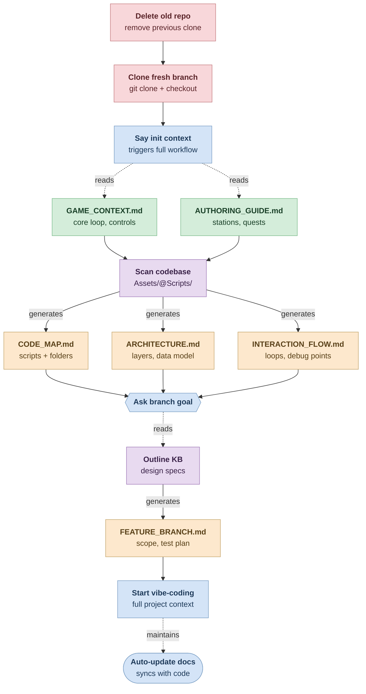

# Init Context Flow

AI context starter kit for vibe-coding Unity features on fresh branches.

## Problem

Every time you clone a new branch and start an AI coding session, you have to re-explain the entire project. This repo shows a workflow that solves that.

## Workflow



## How It Works

1. **Delete old repo**, clone fresh branch from GitHub
2. Say **"init context"** to your AI coding assistant
3. AI reads stable docs (game design, authoring guide) that live outside the repo
4. AI scans the codebase and generates CODE_MAP, ARCHITECTURE, and INTERACTION_FLOW docs
5. AI asks for the branch goal and generates a FEATURE_BRANCH doc
6. Start vibe-coding with full context — AI auto-updates docs as code changes

## File Structure

```
├── CLAUDE.md                          ← auto-loaded, has init context workflow
├── .claudeignore                      ← excludes Library/, node_modules/, etc.
│
├── docs/                              ← STABLE (survives repo deletion)
│   ├── GAME_CONTEXT.md
│   └── SYSTEM_AUTHORING_GUIDE.md
│
├── templates/                         ← SKELETONS (copied + filled per branch)
│   ├── CODE_MAP.template.md
│   ├── ARCHITECTURE.template.md
│   ├── INTERACTION_FLOW.template.md
│   └── FEATURE_BRANCH.template.md
│
└── Fork/
    └── Camp001Project/                ← DISPOSABLE (cloned fresh per branch)
        ├── CLAUDE.md                  ← project rules + "read parent docs first"
        └── docs/                      ← GENERATED (by init context)
            ├── CODE_MAP.md
            ├── ARCHITECTURE.md
            ├── INTERACTION_FLOW.md
            └── FEATURE_BRANCH_*.md
```

### Key Idea

- **Stable docs** live outside the Unity repo — they survive deletion
- **Generated docs** live inside the Unity repo — rebuilt per branch by scanning actual code
- **Templates** ensure consistent structure every time

## Context

Built for Chef Ready, an idle arcade cooking sim for Android, using Claude Code + Unity.
