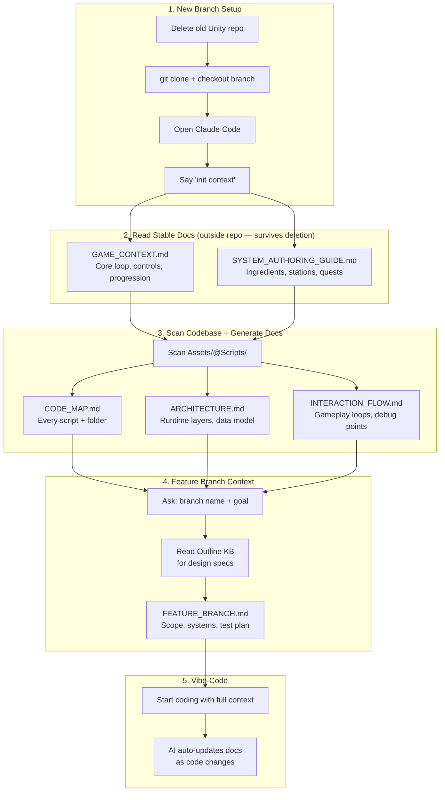

# Init Context Flow



## File Structure

```
Firepit-Claude/
│
├── CLAUDE.md                          ← auto-loaded, has init context workflow
├── .claudeignore                      ← excludes Library/, node_modules/, etc.
│
├── docs/                              ← STABLE (survives repo deletion)
│   ├── GAME_CONTEXT.md
│   └── SYSTEM_AUTHORING_GUIDE.md
│
├── templates/                         ← SKELETONS (copied + filled per branch)
│   ├── CODE_MAP.template.md
│   ├── ARCHITECTURE.template.md
│   ├── INTERACTION_FLOW.template.md
│   └── FEATURE_BRANCH.template.md
│
└── Fork/
    └── Camp001Project/                ← DISPOSABLE (cloned fresh per branch)
        ├── CLAUDE.md                  ← project rules + "read parent docs first"
        └── docs/                      ← GENERATED (by init context)
            ├── CODE_MAP.md
            ├── ARCHITECTURE.md
            ├── INTERACTION_FLOW.md
            └── FEATURE_BRANCH_*.md
```
